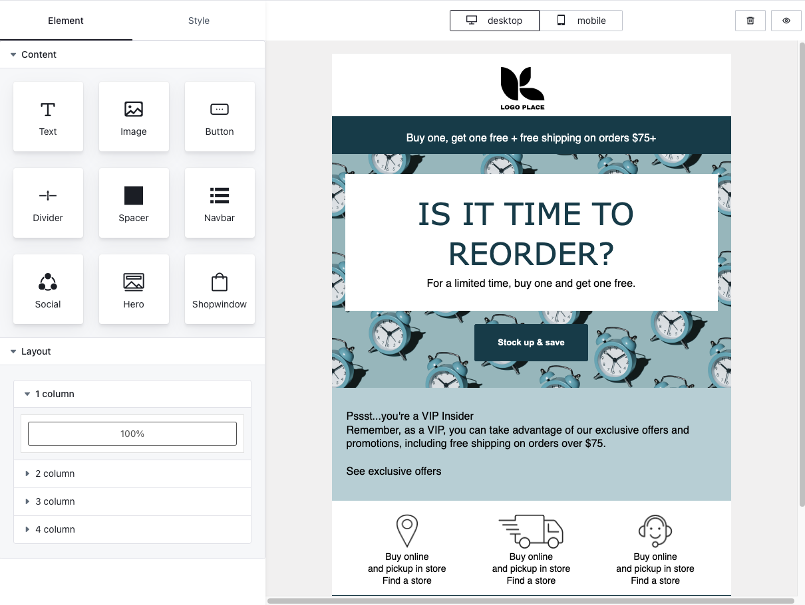
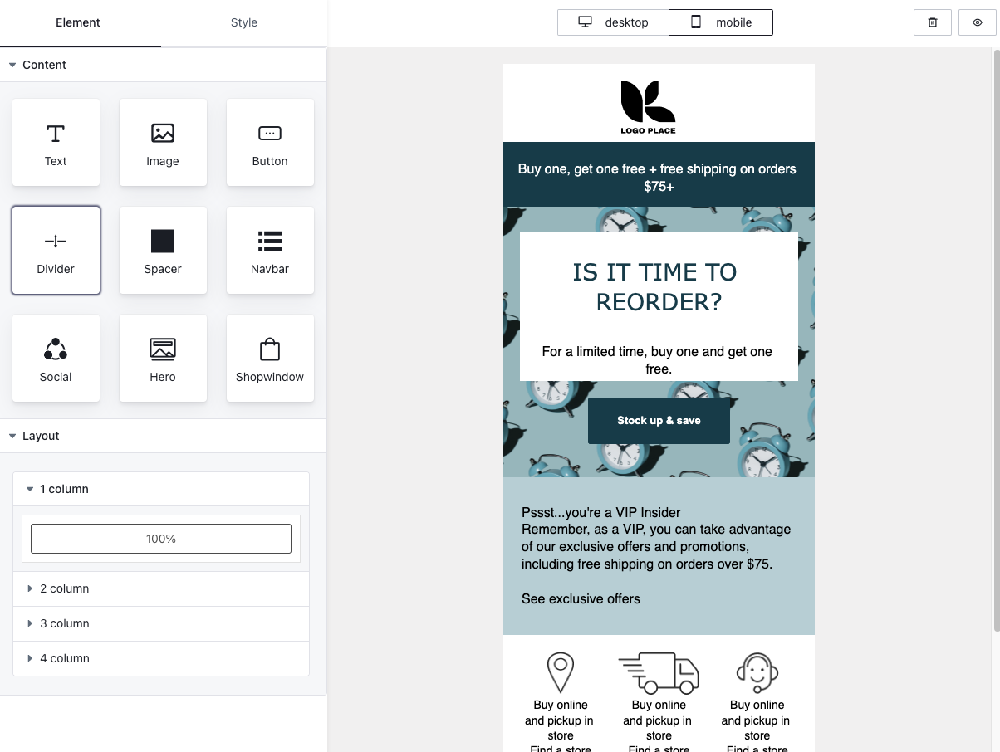

###  Beacas is a responsive drag-and-drop email editor based on Slate and MJML, supporting different content display on Mobile/Desktop.


<div style="font-size:0">
  
  
</div>
<br/>
<div>
  
</div>

## Community
Joining [Slack](https://join.slack.com/t/beacashq/shared_invite/zt-1x0f399h2-9cw8JhBu~kkSpVDcK2iKYg)  grants you full access and privileges.

## Live Demo

Check out the live demo here https://demo.beacas.com

## Getting started

```bash
 npm install --save beacas-core beacas-editor beacas-plugins @arco-design/web-react @arco-themes/react-beacas-theme-retro mjml-browser slate slate-react slate-history
```

## Create your editor

```jsx
import React, { useCallback, useMemo } from "react";
import {
  BeacasEditorProvider,
  EmailEditorProps,
  EmailTemplate,
} from "beacas-editor";
import { BeacasCore, BlockManager, ElementType } from "beacas-core";
import { Retro } from "beacas-plugins";
import 'beacas-plugins/lib/style.css';

// Theme style, If you need to change the theme, you can make a duplicate in https://arco.design/themes/design/6979/setting/base/Color
import '@arco-themes/react-beacas-theme-retro/css/arco.css';

export default function MyEditor() {

  // You can fetch data from the server.
  const initialValues: EmailTemplate | null = useMemo(() => {
    return {
      subject: 'Welcome to Beacas mail',
      content: BlockManager.getBlockByType(ElementType.PAGE).create(),
    };
  }, []);

  // example
  const onUpload = (file: Blob):Promise<string> => {
    return Promise.resolve('https://res.cloudinary.com/dfite2e16/image/upload/v1681907056/clgnivsuj0018z9ltiixmxf6k/ilh6rri61f512i7wb6yd.png')
  }

 const onSubmit: (values: CustomEmailTemplate)=> {
  console.log(values)
 }

const config = Retro.useCreateConfig({
  onUpload,
  initialValues: initialValues,
  onSubmit: onSubmit,
  clientId: "", // optional, for paid user
})

  return (
   <BeacasEditorProvider
      {...config}
    >
      <Retro.Layout height={"calc(100vh - 40px)"}></Retro.Layout>
    </BeacasEditorProvider>
  );
}
```

## Docs

Check out docs here: https://docs.beacas.com
